# Introduction

This project walks through the process of building and analysing the performance of a **Two-Stage Unbuffered CMOS Operational Transconductance Amplifier (OTA)** using SPICE.

This project was made to teach myself how to design circuits rather than simply analyse the equations or solve problems in standard college curricula.

*Why a two-stage CMOS OTA?*
---

The two stage CMOS OTA is a introductory circuit in the study of op-amps that uses a standard single output differential pair and a common source stage in cascade, making it easier to analyze.

- It uses cascaded topology which provides higher gain compared to single stage amplifiers.
- The second stage uses only 2 transistors, which results is high output swing.
- CMOS amps suffer less from non-idealities compared to their BJT counterparts due to their extremely high input impedance.

The above reasons make it a very enticing circuit to learn design process without getting overwhelmed.

# Architecture

The two-stage op-amp consists of a differential amplifier converting the differential input voltage to differential currents. These differential currents are applied to a current-mirror load recovering the differential voltage. This is nothing but a differential amplifier. 

The second stage consists of common-source MOSFET converting the second-stage input voltage into current. This transistor is loaded by a current-sink load, which converts the current to voltage at the output.

The block diagram and transistor-level broken into V->I and I->V stages is shown in fig 1.

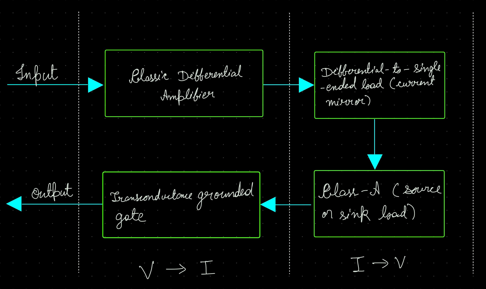
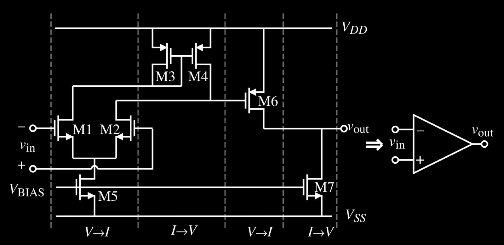

# General Design of the Op-Amp

The design of op-amps can be divided into two distinct design related activities that are for the most part independent of each other.

- The general schematic, which we have already decided above.
- Calculating the dc currents, sizing up the transistors and designing the compensation network, based on the requirements.

The boundary conditions and requirements we will need to design our op-amp:

- Boundary Conditions:

    1. Process Specification ($V_{T}$, $K'$, $C_{ox}$, etc.)
    2. Supply Voltage and Range

- Requirements:
    1. Gain
    2. Unity Gain Bandwidth
    3. Slew Rate
    4. Input Common-Mode range ($ICMR$)
    5. Output-voltage swing
    6. Phase Margin
    7. Power Dissipation

In our first iteration, let us use the basic topology as seen in fig 2.

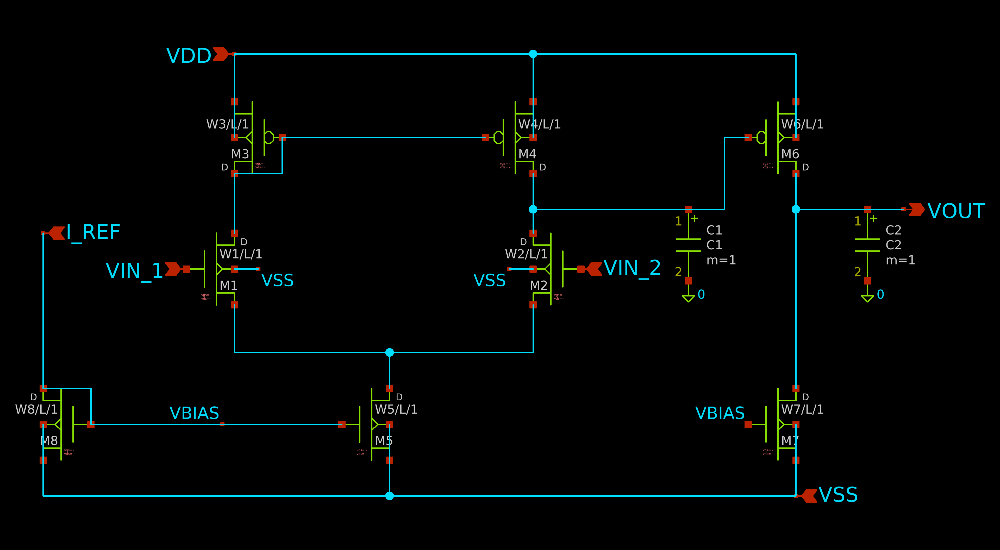

The small signal model for this circuit is given in fig 3.

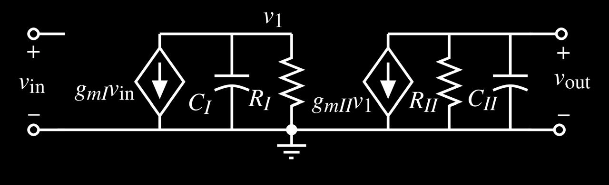

The locations of the two poles are given as:

$`\ p'_{1} = (\frac{-1}{R_{I}.C_{I}}) `$ and $`\ p'_{2} = (\frac{-1}{R_{II}.C_{II}}) `$

Where $R_{I}$/$C_{I}$ and $R_{II}$/$C_{II}$ are resistance/capacitance to ground seen from the output of the first stage and second stage respectively.

In a general case, these poles are far away from the origin and relatively close together. Fig 4 illustrates the open-loop frequency response of a negative-feedback loop op-amp in fig 2.

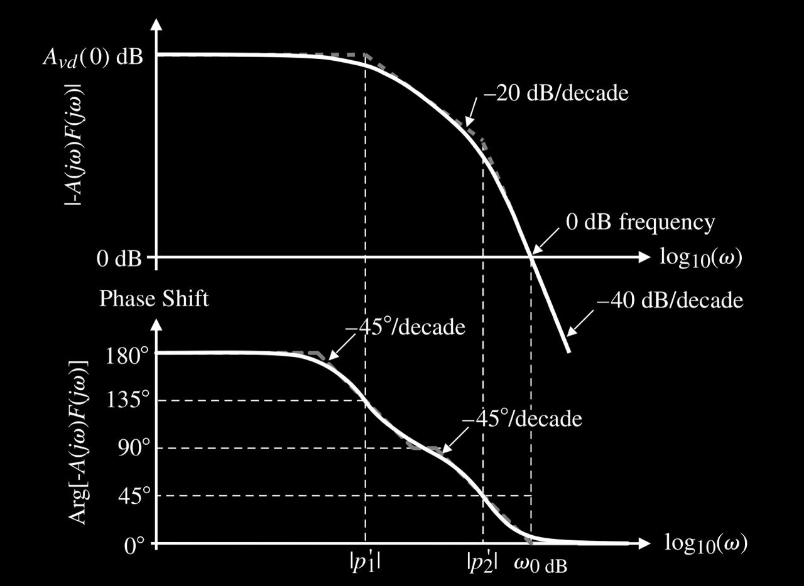

As seen in Fig 4, the phase margin is significantly less than $45^{\circ}$, which will lead to instability. Thus, the op-amp needs to be compensated before using it in a closed loop configuration.

## Miller Compensation

Adding the compensation capacitor $C_{c}$, the resulting circuit is shown in Fig 5:

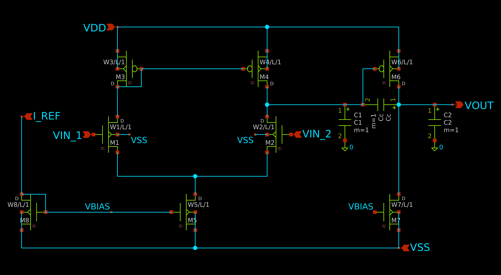

The resulting small-signal model is shown in Fig 6:

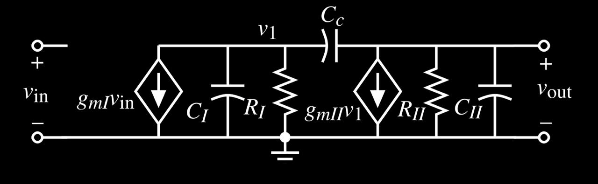

Using Miller's Approximation and finding poles by inspection, we have

$`\ p_{1} \approx (\frac{-1}{R_{I}.[C_{I} + C_{c}(1 + g_{mII}.R_{II})]})`$

$`\ p_{2} \approx (\frac{-g_{mII}}{C_{II} + C_{c}}) \approx (\frac{-g_{mII}}{C_{II}}) ;\space if \space C_{II} > C_{c}`$

A zero also occurs on the positive real axis, which can be found from the small signal model relatively easily by setting $A_{v} = 0$

$`\ z_{1} = (\frac{g_{mII}}{C_{c}}) `$

The addition of miller capacitance moves the dominant pole $(p_{1})$ to the left and shifts the non dominant pole $(p_{2})$ to the right.

If we use our assumption of $C_{II} > C_{c}$, then the zero is further to the right of $(p_{2})$

Fig 7 shows results of compensation compared to the uncompensated state.

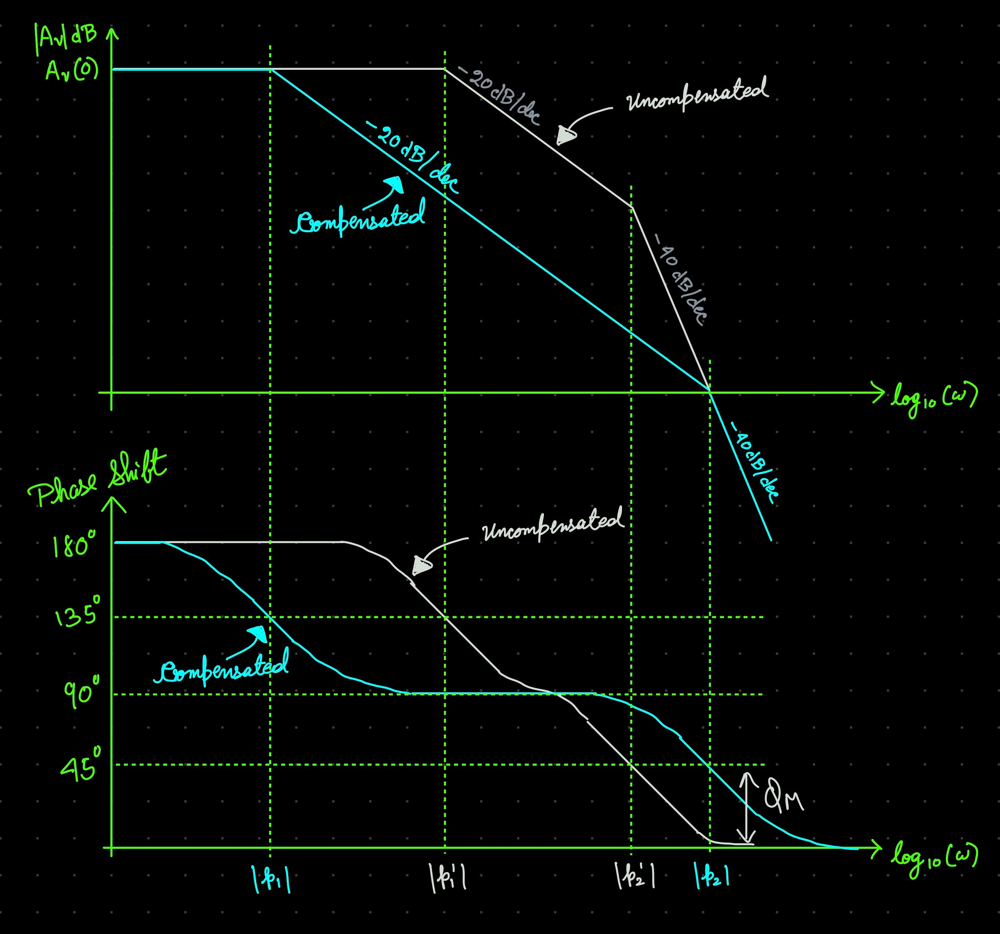

The **unity gain bandwidth** is defined as the angular frequency (or frequency) when the gain crosses the $0dB$ mark. It is given as:

$`(\omega_{GBW}) \approx (\frac{g_{mI}}{C_{c}})`$

If we define $z_{1} > 10.{\omega_{GBW}}$, then, to achieve $\phi_{M} > 60^{\circ}$, we need the following condition:

- $p_{2} > 2.2.{\omega_{GBW}}$  
OR
- $C_{c} > 0.22.C_{2}$

## Designing the Op-Amp

Before beginning, let us summarise the important relationships:

1. First Stage Gain: $ A_{v1} = \frac{-g_{m1}}{g_{ds2} + g_{ds4}} = \frac{-2.g_{m1}}{I_{5}.(\lambda_{2} + \lambda_{4})} $
2. Second Stage Gain: $ A_{v2} = \frac{-g_{m2}}{g_{ds6} + g_{ds7}} = \frac{-2.g_{m2}}{I_{6}.(\lambda_{6} + \lambda_{7})} $
3. Unity Gain Bandwidth: $`\omega_{GBW} \approx \frac{g_{m2}}{C_{c}}`$
4. Slew Rate: $ SR = \frac{I_{5}}{C_{c}} $
5. $ICMR+ (V_{in}(max)) = V_{DD} - \sqrt{\frac{I_{5}}{K'(\frac{W}{L})_{3}}} - |V_{T03}|(max) + V_{T1}(min)$
6. $ICMR- (V_{in}(min)) = V_{SS} + \sqrt{\frac{I_{5}}{K'(\frac{W}{L})_{1}}} + V_{T1}(max) + V_{DS5}(sat)$
7. Saturation Voltage: $ V_{DS5}(sat) = \sqrt{\frac{2.I_{DS}}{K'(\frac{W}{L})}} $

Going onto the design procedure, a first cut sequence we can follow is:

- The design procedure begins by choosing a device length to be used by the circuit. This length determines the channel length modulation parameter $(\lambda)$, which is necessary to calculate amplifier gain.

- Keeping our definition of $z_{1} > 10.{\omega_{GBW}}$, minimum value of $C_{c}$ can be defined as: $C_{c} > 0.22.C_{2}$

- Next, minimum value of tail current $(I_{5})$ can be determined by $ I_{5} = SR.C_{c} $

- $ (\frac{W}{L})_{3} = (\frac{W}{L})_{4} = \frac{I_{5}}{(K'_{3}).(ICMR+)^{2}} $

- $ g_{m1} = g_{m2} = {\omega_{GBW}}.C_{c} $

- $ V_{DS5} = (ICMR-) - V_{SS} - \sqrt{\frac{I_{5}}{K'(\frac{W}{L})_{1}}} - V_{T1}(max) $

- $ (\frac{W}{L})_{5} = \frac{2.I_{5}}{K'_{5}.(V_{DS5})^{2}} $

- Again, following $z_{1} > 10.{\omega_{GBW}}$, we have: $ g_{m6} = 2.2(g_{m2})(\frac{C_{L}}{C_c}) $

- $ (\frac{W}{L})_{6} = (\frac{W}{L})_{4}.(\frac{g_{m6}}{g_{m4}}) $

- $ I_{6} = \frac{g_{m6}^{2}}{2.K'_{6}.(\frac{W}{L})_{6}} $

- $ (\frac{W}{L})_{7} =  (\frac{W}{L})_{5}.(\frac{I_{6}}{I_{5}})$

- $ P_{dis} = (I_{5} + I_{6} + I_{8}).(V_{DD} + |V_{SS}|) $

- Now, the gain must be checked against the specifications, if it is too low, $I_{5}$ and $I_{6}$ may be decreased or the ratios $(\frac{W}{L})_{2}$ and $(\frac{W}{L})_{6}$ may be increased. All the previous calculations need to be performed again to ensure all conditions are satisfied.

### Biasing

- A current mirror approach with a stable reference current (say, using $\beta-Multiplier$) is used to bias the current sink $M_{7}$ and tail current source $M_{5}$

    - Since $M_{8}$ acts as our reference current mirror, we can have $ (\frac{W}{L})_{8} = (\frac{W}{L})_{5} $ to set $ I_{tail}=I_{ref} $, and the relation of $ (\frac{W}{L})_{5} $ with $ (\frac{W}{L})_{7} $ is known from above calculations.

- The Bias Point of the differential input is found as:
    - $ g_m = \frac{2I_{D}}{V_{ov}} $
    - $ |A_{v1}| = \frac{g_{m1}}{g_{ds2} + g_{ds4}} = \frac{2}{V_{ov}.(\lambda_{2}+\lambda_{4})} $
    - $ V_{ov} = \frac{2}{|A_{v1}|.(\lambda_{2}+\lambda_{4})} $ 

The specifications we will use are as follows:

- $ A_{v} > 5000 V/V $
- $ {\omega_{GBW}} = 5MHz $
- $\phi_{M} > 60^{\circ}$
- $ICMR- = -1V$
- $ICMR+ = 2V$
- $SR > 10V/us$
- $V_{out} \pm2V$
- $V_{DD} = 2.5V$
- $V_{SS} = -2.5V$
- $C_{L} = 10pF$
- $P_{dis} < 2mW$
- $L = 1um$

The important process parameters from the model used are:

- $ K'_{n} = 120uA/V^{2} $
- $ V_{TN} = 0.8V $
- $ K'_{p} = 40uA/V^{2} $
- $ V_{TP} = -0.9V $

Following the design procedure and substituting the values from requirements and process parameters, the initial calculated values are:

- $ C_{c} = 3pF $
- $ I_{5} = 30uA $
- $ (\frac{W}{L})_{3} = (\frac{W}{L})_{4} \approx 10 $
- $ g_{m1} = g_{m2} = 94.2uS $
- $ g_{m3} = g_{m4} = 109uS $
- $ (\frac{W}{L})_{1} = (\frac{W}{L})_{2} \approx 3 $
- $ V_{DS5}(sat) = 0.411 $
- $ (\frac{W}{L})_{5} \approx 3 $
- $ g_{m6} = 942uS $
- $ (\frac{W}{L})_{6} \approx 86.6 $
- $ I_{6} = 130uA $
- $ (\frac{W}{L})_{7} \approx 13 $
- $ V_{CM} = 1.118V $
- $ A_{v} \approx 5600 $
- $ P_{dis} = 0.95mW $

These initial values were entered into xschem and simulated. The following sections document the schematic implementation, challenges encountered in measuring the open-loop gain and the iterative refinements made to meet all specifications.

## Pre-Simulation Predictions

Based on the napkin math above, the following performace is expected:

| Parameter | Predicted Value | Specification |
|-----------|----------------|---------------|
| DC Gain | $\approx74.9 dB (5600 V/V)$ | $> 73.98 dB (5000 V/V)$ |
| GBW | $5 MHz$ | $5 MHz$ |
| Phase Margin | $> 60^{\circ}$ | $> 60^{\circ}$ |
| Slew Rate | $10 V/μs$ | > $10 V/μs$ |
| Power |  $0.95mW$ | < $2mW$ |

## Schematic Implementation

The circuit was implemented in xschem with ngspice using Level 3 SPICE model with 1um channel length. The complete schematic is shown in Fig 8.

*Source for model: https://cmosedu.com/cmos1/cmosedu_models.txt*

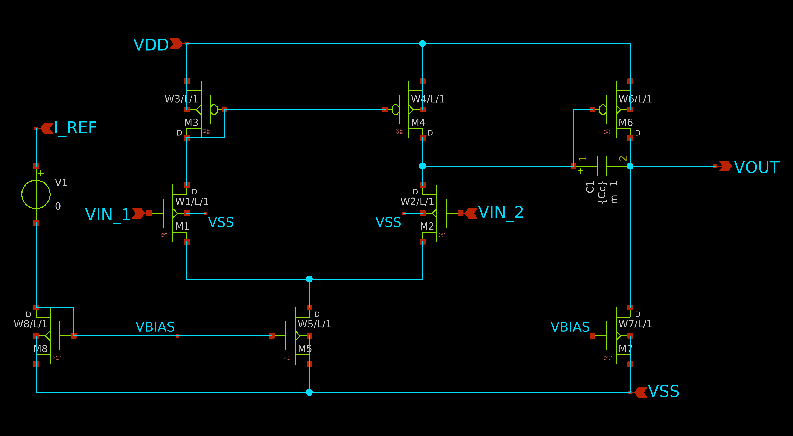

The final transistor sizing after all iterations is summarised 
in the table below:

| Transistor | Type | W/L 
|------------|------|-----|
| M1, M2 | NMOS | 3.5 |
| M3, M4 | PMOS | 10 |
| M5 | NMOS | 3 |
| M6 | PMOS | 86.6 |
| M7 | NMOS | 13 |
| M8 | NMOS | 3 |

Component values: $C_c = 2.5pF$, $C_L = 10pF$

---
# Simulation Results

## DC Operating Point

All transistors were verified to be in saturation before AC analysis. The testbench is shown in Fig 9.

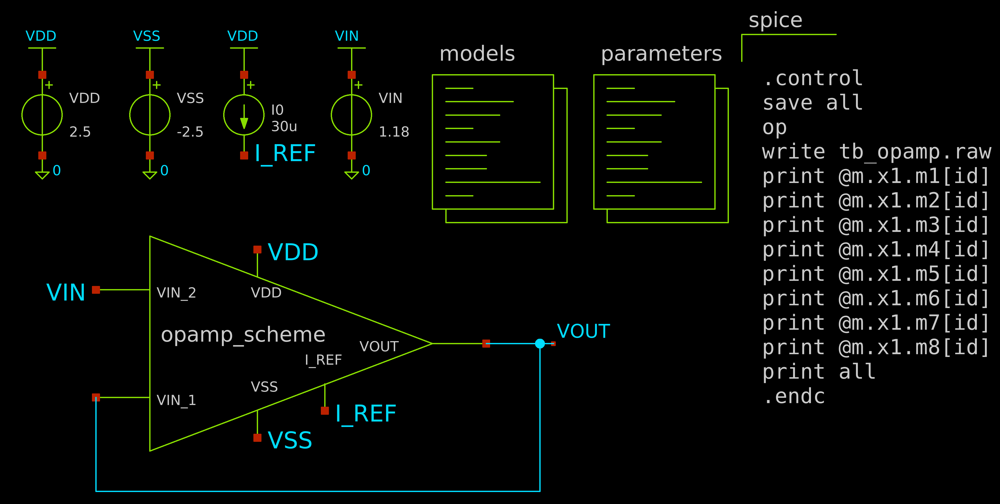

| Transistor | $\|V_{ov}\|$ | $\|V_{DS}\|$ | Region |
|------------|----------|----------|--------------|
| M1 | 0.745 | 1.748 | Saturation |
| M2 | 0.745 | 1.706 | Saturation |
| M3 | 0.216 | 1.116 | Saturation |
| M4 | 0.216 | 1.159 | Saturation |
| M5 | 0.463 | 2.134 | Saturation |
| M6 | 0.259 | 1.320 | Saturation |
| M7 | 0.463 | 3.679 | Saturation |
| M8 | 0.463 | 1.263 | Saturation |

## Open-Loop Gain Measurement (AC Analysis)

Simulation of measurement of open-loop gain of op-amp is a difficult step to perform. The reason is the high differential gain in op-amps.

In our case, with a gain of ~5000V/V, any offset voltage present is amplified by $5000.V_{OS}$ at the output. So, for any $V_{OS} < 0.5mV$, the output is driven to the maximum output swing possible, making it difficult to measure the open loop gain. This is shown in Fig 10.

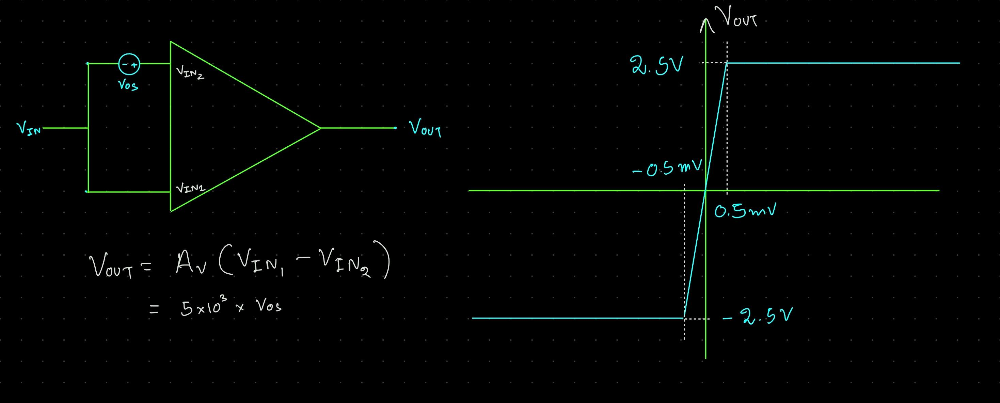

To measure the open-loop gain, I have tried two different methods.

### The LC Method

This is a conceptually neat method. A large inductor is used between the feedback between $V_{out}$ and $V_{IN1}$, and a large capacitor is used between $V_{IN1}$ and $GND$.

At DC level, $f=0$, so the inductor acts as a short circuit, while the capacitor acts as open circuit, this results the amplifier working as a unity gain amplifier. 

When a small AC signal (say, $V_{in})$ is applied, the inductor, which has a large value, essentially operates as an open circuit, while the capacitor acts as a short circuit to $GND$. So, $V_{out} = A_{v}.V_{in}$.

The test bench and simulation results with this method are given in Fig 11 and Fig 12.

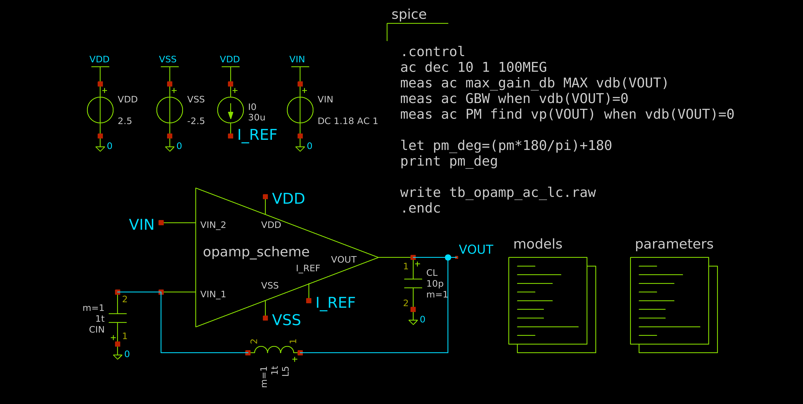

However, this is not a practical method, since such large inductors and capacitors are generally not available.

### The RC Method

This method uses a large resistor $(R_f)$ in place of the inductor. Because the gate terminal of the input MOSFET has very high DC impedance, the steady-state current flowing through the feedback loop is approximately zero ($I_f \approx 0$). Consequently, there is zero voltage drop across $R_f$, this forces $V_{out} = V_{in1}$ and causes the circuit to operate as a unity-gain amplifier at DC.

On applying a small AC signal, the capacitor acts as a short-circuit to $GND$. So, again operating in the open-loop configuration, $V_{out} = A_{v}.V_{in}$.

In this circuit, it is necessary to select the $\frac{1}{RC}$ time constant a factor of $A_v(0)$ less than the anticipated dominant pole of the op-amp. The true open loop characteristics will not be observed until the frequency is approximately $\frac{A_v(0)}{RC}$, Above this frequency, the gain is essentially the open-loop gain of the op-amp. This method works well for both simulation and measurement.

##### Component Selection

To make sure the newly introduced zero doesn't interfere with our gain, values of $C_{in} = 10uF$ and $R_f = 10M\Omega$ were chosen so the pole lines very close to the origin.

$f_{z} = \frac{1}{2.\pi.RC} \approx 1.59mHz$

As mentioned above, the true open loop characteristics will not be observed until the frequency is approximately $\frac{A_v(0)}{RC}$, i.e, the new pole.

$f_{obs} = \frac{A_{v}(0)}{2.\pi.RC} \approx 8.9Hz$

So, we begin seeing the open-loop gain near 10Hz.

The test bench and simulation results with this method are given in Fig 13 and Fig 14.

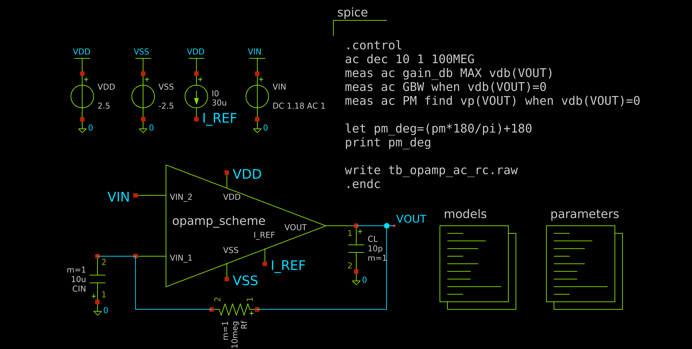

The results using both methods are given below:

| Parameter | LC Method | RC Method | Specification |
|-----------|-----------|-----------|---------------|
| Max Gain | 74.07 dB | 74.00 dB | >73.98 dB |
| GBW | 5.85 MHz | 5.85 MHz | 5 MHz |
| Phase Margin | 63.18° | 63.19 | >60° |

## Transient Response and Slew Rate

A large-signal step input was applied to measure the slew rate. The test bench and output waveforms are shown in Fig 15 and Fig 16.

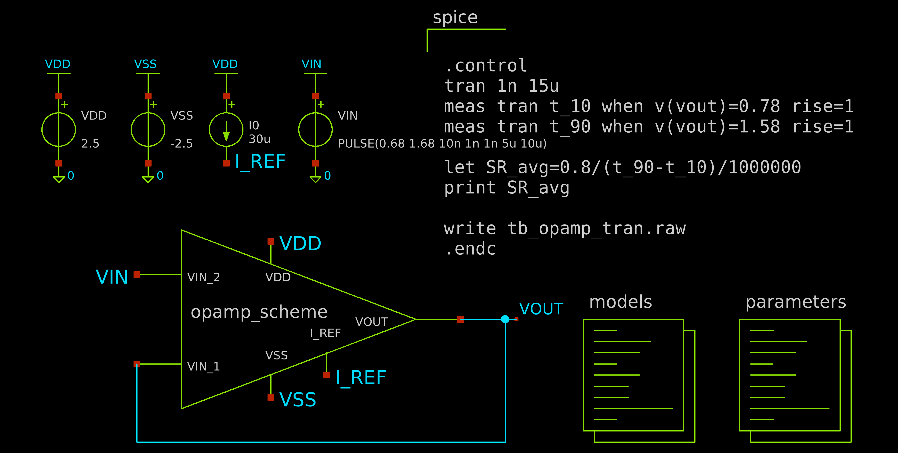

The average slew rate is measured between 10% and 90% of the final voltage swing. It is found to be:

$SR = 10.637V/{\mu}s$

## DC Sweep - Linear Output Swing

The linear output swing is defined as the voltage range over which the amplifier maintains at least 90% of its ideal gain. Because the circuit is configured as a unity-gain buffer, the ideal DC transfer characteristic has a slope of $1\space{V/V}$. Therefore, the absolute limits of the output swing are identified as the points where the derivative of the transfer curve $\frac{dV_{out}}{dV_{in}}$ drops below $0.9 \space V/V$

The test bench and simulation result are given in Fig 17 and Fig 18.

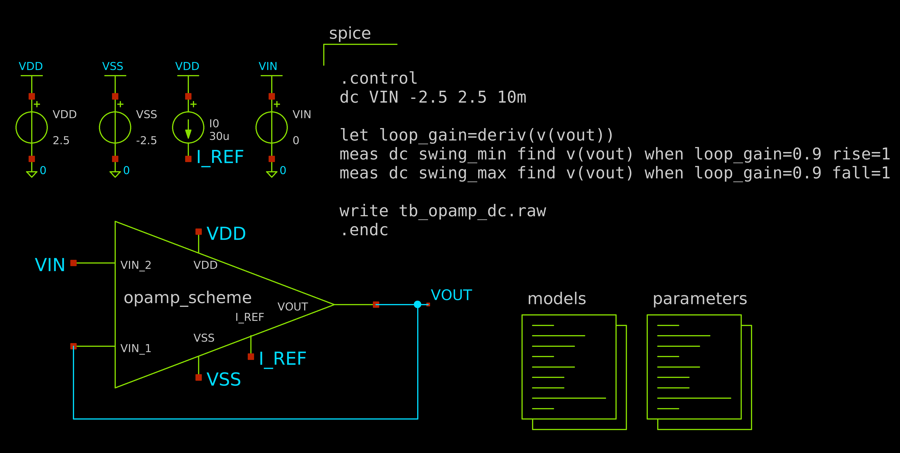

The results obtained are given below:

- $V_{out}(max) = 2.44V$
- $V_{out}(min) = -2.27V$
---

# Design Iterations

## Iteration 1 - Initial Sizing ($\frac{W}{L} = 3$ for M1 and M2)

| Parameter | Target | Result |
|-----------|--------|--------|
| Max Gain | $> 73.98 dB$ | $73.25 dB$ |
| GBW | $5 MHz$ | $4.55 MHz$ |
| Phase Margin | $>60^{\circ}$ | $68.08^{\circ}$ |

Both Max Gain and GBW were not upto specification.

Since $GBW = \frac{g_{m1}}{2\pi C_c}$ and $g_{m1} = \sqrt{2K'_p \cdot \frac{W}{L} \cdot I_{D1}}$, increasing $g_{m1}$ simultaneously increases both GBW as well as the first-stage gain.

So, increasing $\frac{W}{L}$ for M1 and M2 may be the way to go.

## Iteration 2 - ($\frac{W}{L} = 3.5$ for M1 and M2)

| Parameter | Target | Result |
|-----------|--------|--------|
| Max Gain | $> 73.98 dB$ | $74.07 dB$ |
| GBW | $5 MHz$ | $4.96 MHz$ |
| Phase Margin | $>60^{\circ}$ | $66.20^{\circ}$ |
| Slew Rate | $>10u/V^2$ | $8.86u/V^2$ |

While the gain and GBW seem to be well within specifications, the slew rate is lower than our target.

$ SR = \frac{I_{5}}{C_{c}} $, we may either try increasing $I_5$ or decreasing $C_{c}$. Increasing $I_5$ requires us to go through every calculation step above again to get the updated sizing. 

Our use of $C_c = 3pF$ is well above the condition of $C_c > 0.22C_L$, which means $C_c > 2.2pF$.

Let us choose $C_c = 2.5pF$

## Iteration 3 - ($C_c = 2.5pF$)

| Parameter | Target | Result |
|-----------|--------|--------|
| Max Gain | $> 73.98 dB$ | $74.07 dB$ |
| GBW | $5 MHz$ | $5.85 MHz$ |
| Phase Margin | $>60^{\circ}$ | $63.18^{\circ}$ |
| Slew Rate | $>10u/V^2$ | $10.64u/V^2$ |

Now we seem to be within good margins of out specifications.

We will adopt this sizing.

